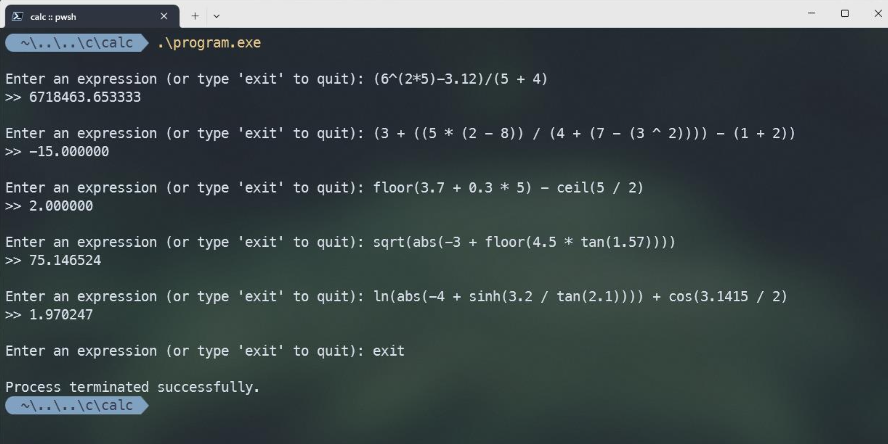

# Flex Bison Calculator



- Supports the following math functions: Add - Subtract - Divide - Multiply - Power - Assignment - Sin -Cos - Sqrt - Abs - Exp - Sinh - Cosh

- Can recognize both Integer and Float values. 

- Can recognize scientific values as Float (e.g. 314e-2 = 3.14). 

- Can Assign values to identifires using "=" sign. 

- Prints out a list of used Tokens in each command. 

- Prints out the final output of the enterd math function as a Double value.

# CFG

The equivalent CFG for the grammer used in this project is as follows :

```
stmts → stmt stmts
stmts → ε
stmt → 𝑖𝑑 {𝐸𝑚𝑖𝑡(lvalue + 𝑖𝑑. 𝑙𝑒𝑥)} = expr{𝐸𝑚𝑖𝑡("𝑎𝑠𝑠𝑖𝑔𝑛")};
expr → expr + term {𝐸𝑚𝑖𝑡("𝑎𝑑𝑑")}
expr → expr − term {𝐸𝑚𝑖𝑡("𝑠𝑢𝑏")}
expr → term
term → term ∗ unary {𝐸𝑚𝑖𝑡("𝑚𝑢𝑙")}
term → term / unary {𝐸𝑚𝑖𝑡("𝑑𝑖𝑣")}
term → unary
unary → −unary {𝐸𝑚𝑖𝑡("𝑛𝑒𝑔")}
unary → pow
pow → factor ^ pow {𝐸𝑚𝑖𝑡("𝑝𝑜𝑤")}
pow → factor
factor → id {𝐸𝑚𝑖𝑡("rvalue " + 𝑖d. 𝑙𝑒𝑥)}
factor → 𝑖𝑛𝑡 {𝐸𝑚𝑖𝑡("𝑝𝑢𝑠h " + 𝑖𝑛𝑡. 𝑙𝑒𝑥)}
factor → 𝑓𝑙𝑜𝑎𝑡 {𝐸𝑚𝑖𝑡("𝑝𝑢𝑠h " + 𝑓𝑙𝑜𝑎𝑡. 𝑙𝑒𝑥)}
factor → (expr)
factor → sin(expr) {𝐸𝑚𝑖𝑡("𝑠𝑖𝑛 " )}
factor → cos(expr){𝐸𝑚𝑖𝑡("𝑐𝑜𝑠 " )}
factor → sqrt(expr){𝐸𝑚𝑖𝑡("𝑠𝑞𝑟𝑡 " )}
factor → abs(expr){𝐸𝑚𝑖𝑡("𝑎𝑏𝑠 " )}
factor → exp(expr){𝐸𝑚𝑖𝑡("𝑒𝑥𝑝 " )}
factor → sinh(expr){𝐸𝑚𝑖𝑡("𝑠𝑖𝑛h " )}
factor → cosh(expr){𝐸𝑚𝑖𝑡("𝑐𝑜𝑠h ")}
```

# Usage

First of all, please make sure that both Flex and Bison are installed.  
To use the calculator, clone the project. Open command prompt and ```cd``` to the directory. Then use the following commands. If there were warnings, ignore them.

**Using make**

```shell
--Compile
make clean
make

--Run
./program.exe
```

**Manual**

```shell
--Compile
bison -d grammar.y
flex --header-file=lex.yy.h scanner.l
gcc -o program lex.yy.c grammar.tab.c main.c

--Run
./program.exe
```

# Example

Example output for a valid input:

```shell
Enter an expression (or type 'exit' to quit): 1.5 - sqrt(4 +
5^2) - tan(0.5)
>> Result: -4.431467
```

Input of an expression with unbalanced parentheses:

```shell
Enter an expression (or type 'exit' to quit): sqrt(4 + (5 * 3)
>> Warning: Unbalanced parentheses at line 1, column 5
>> The expression is invalid.
```

Representation

```c
a=2
T_IDEN  T_EQL  T_INT  = 2.000000
a^3
T_IDEN  T_POW  T_INT  = 8.000000

23 + sin(sqrt(16))
T_INT  T_ADD  T_SIN  T_PRNL  T_SQRT  T_PRNL  T_INT  T_PRNR  T_PRNR  = 22.243198

100 + 2e2
T_INT  T_ADD  T_FLOAT  = 300.000000
```

Examples for testing

```c
3 + 5 * 2 - 8 / 4
(7 - 3) * (2 + 4) / 3
5 * (2 + 3) ^ 2
8 / 2 + 7 - (3 * 4)
(6 ^ 2 - 3) / (5 + 4)
3.5 + 4.8 * (2.2 - 1.1)
7 ^ 2 - 5 * (6 / 3)
((3 + (5 * (2 - (8 / 4)))) + ((7 - 3) * (2 + 4)) / 3)
((5 * ((2 + 3) ^ 2)) - ((8 / 2) + (7 - (3 * 4))))
(6 ^ (2 - 3)) / ((5 + 4) * (3.5 + (4.8 * (2.2 - 1.1))))
(((7 ^ 2) - (5 * ((6 / 3) + 1))) + ((2 ^ 3) - (4 / (2 + 1))))
(3 + ((5 * (2 - 8)) / (4 + (7 - (3 ^ 2)))) - (1 + 2))
((2 ^ 3) + (4 * (6 - (5 / (2 + 1))))) / ((7 + 2) * (5 - (3 / (1
+ 1))))
(((4 + 3) * ((7 / 2) - (5 ^ 2))) + (8 - (2 * (3 + 5)))) / (2 ^
(3 - 1))
abs(-3.4 + 5 * 2) - sqrt(9 + 16)
cos(3.1415 / 2) + tan(45) * log(100)
exp(2) - sin(3.1415 / 4) + 5 ^ 2
sqrt(64) / 4 + sinh(0) * (7 - 2)
floor(3.7 + 0.3 * 5) - ceil(5 / 2)
log(1000) + cosh(3) - 7 * tanh(0.5)
abs(-5 + 3 * 2) + sqrt(25) - ln(10 / 2)
sqrt(abs(-3 + floor(4.5 * tan(1.57))))
log(exp(3 + sin(2 * cosh(1)))) + tanh(0.5)
abs(cos(3.1415 / 4) + sin(tan(1.2 ^ 2)))
sqrt(25 + abs(-5 + log(100 / cos(0.5))))
ceil(exp(log(10) + floor(2.3 + sqrt(16))))
sin(cosh(2.5) + tan(floor(4.8 - 3 * sqrt(9))))
ln(abs(-4 + sinh(3.2 / tan(2.1)))) + cos(3.1415 / 2)
```
